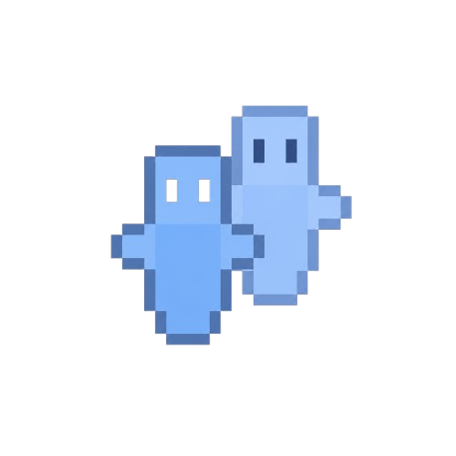
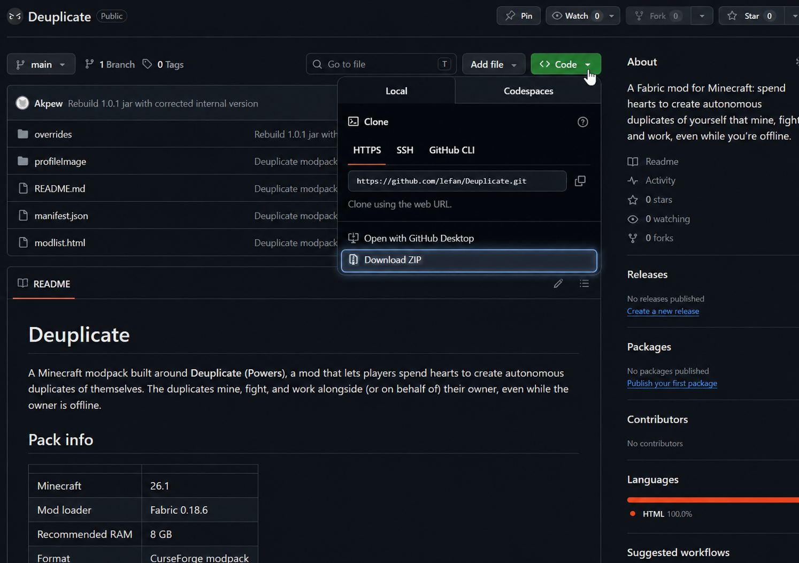

  

  # Deuplicate

  **A Minecraft modpack built around the Deuplicate mod — spend hearts to create autonomous duplicates of yourself that mine, fight, and work, even while you're offline.**

---

## Pack info

| | |
|---|---|
| Minecraft       | 26.1 |
| Mod loader      | Fabric 0.18.6 |
| Recommended RAM | 8 GB |
| Format          | CurseForge modpack |

## Download & install

**1. Download this pack as a ZIP.**
Click the green **`< > Code`** button near the top of this page, then **Download ZIP**:

**2. Import it into CurseForge.**
Open the CurseForge app and bring in the ZIP like any normal modpack — **drag-and-drop the ZIP onto CurseForge**, or use **Create Custom Profile → Import** and select the ZIP.

**3. Launch the profile and play.**

## What's inside

Built around the **Deuplicate** mod (Fabric, Minecraft 26.1.2) plus a handful of supporting mods. See [`modlist.html`](modlist.html) for the full list.
